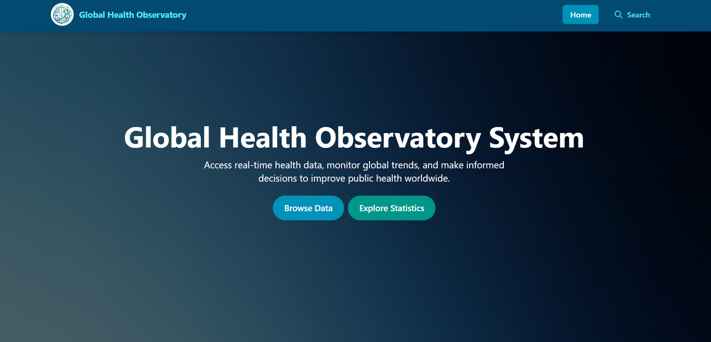

# PELEC202 + ITPS205 ReactJS Finals Project
Our finals project as a collaborative team.

## Preview


## Members:
- [Calderon, Khian Victory **(Team Leader)**](https://github.com/khianvictorycalderon)
- [Calderon, Nichole Allyson](https://github.com/alleysOonie)
- [Diño, Yeasha](https://github.com/Yeasha-Mei-P-Dino)
- [Alonzo, Sean](https://github.com/Incineradia)
- [Perlada, Christian Abuel](https://github.com/C-Perlada)
- [San Agustin, Jhonas](https://github.com/SA0817)
- [Fernandez, Benedict](https://github.com/benedict1117)
- [Mamac, John Michael](https://github.com/JM17mc)
- [Pronton, Jonel](https://github.com/jnl06)
- [Jorquia, Jose](https://github.com/josemariajorquia)
- [Genton, Lester](https://github.com/ReleasedDevil)
- [Talento, Mark Angelo](https://github.com/Newmatt360)
- [Llanora, Mark Anthony](https://github.com/Markanthonyllanora)
- [Hufana, Syke Vincent](https://github.com/SykeHufana)
- [Esguerra, Nathaniel](https://github.com/NielEsguerra)
- [Bermudez, Rommelgio](https://github.com/romgio)
- [Tomo, Warren](https://github.com/renam0to)

---

## Initial Setup Instruction for Members Only:
1. Download and install [NodeJS](https://nodejs.org/en/download) and [Git](https://git-scm.com/install/) if you don't have it yet.
2. Clone this repository by opening `git bash` or `cmd` on a folder where you want it to be stored (*`Example: D:\my-projects, Documents, Desktop, etc...`, its up to you*), and run this command `git clone https://github.com/khianvictorycalderon/pelec202-itps205-finals-project-g3.git`
3. Go to `pelec202-itps205-finals-project-g3` folder and open VS code inside it. After opening, you should see `public` and `src` folders and bunch of other files.
4. Run `npm install` and wait for it to finish. After installing, you should see a `node_modules` folder. **IGNORE** the **Vulnerabilities** message. Example: `26 vulnerabilities (9 low, 3 moderate, 14 high)`.
5. Run `npm start` to start development server. You can now edit files inside `src` folder, and do what I assigned to you.

## Push and Pull Instruction for Members Only
1. After the initial setup, always run `git pull origin main` before committing files for latest version of the files.
2. If you are done with the task assigned to you, commit all the files you've changed by running the following commands:
    ```git
    git add .
    git commit -m "<Your-Message>"
    ```
    Change the `<Your-Message>` into a **useful** commit message, such as what you've changed, what still needs to be done, and so on.

    Examples of Good commit message:
    ```
    Added navbar
    Fix glitch bug
    Completed landing page, but mock UI only, logic to be implemented later
    ```

    Examples of Bad commit message:
    ```
    Updated
    Commit
    Completed
    ```

    Good commit message relies the information to other developers. Bad commit message maybe fine if you are solo in a project, but since this is a team project, always use commit message that signals intentions or detailed changes so that other team members can finish the project faster.
3. After commit, push your changes into the GitHub repository by running `git push -u origin main:<your-branch>`. Change the `<your-branch>` to the branch name assigned to you. Example: `git push -u origin main:browse-card`.

## NOTES for Members Only:
- Do not modify `package.json`, `package-lock.json`, and `.gitignore` because they are files generated by the node and editing it without you knowing what you are doing can cause the application to break.
- **NEVER EVER** push to `main` branch.
- Always listen to instructions carefully.
- If a new package has been installed, run `npm install` again.
- If you have questions, concerns, clarifications, suggestion, just message me or in our GC.

---

## Dependencies & Configuration
The following is a list of installed dependencies and configuration settings used in this project.
You don’t need to install anything manually, as all dependencies are already managed through `package.json` when you ran the `npm install`, it automatically installed all the packages listed in `package.json`.
This section is provided for reference only, to give you insight into how the project was set up.

## Dependencies
- `npm install chart.js react-chartjs-2 react-router-dom @reduxjs/toolkit react-redux`